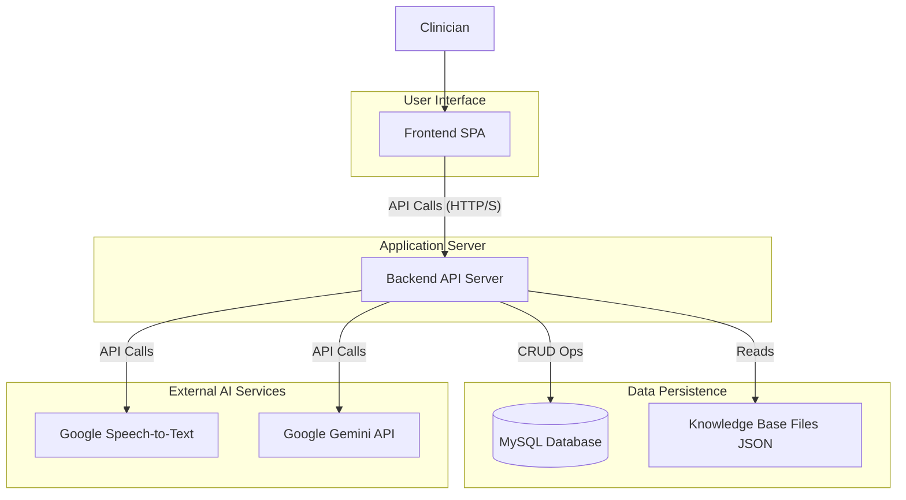
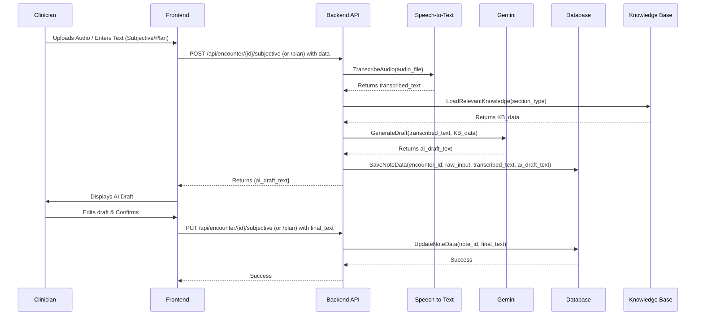

# AI Medical Scribe - System Architecture

## 1. Introduction / Overview 🎯

This document outlines the high-level system architecture for the AI Medical Scribe project. It describes the major components, their responsibilities, interactions, and the overall technology stack. This architecture aims to meet the project goals of developing an AI-powered tool to assist clinicians in generating SOAP notes, with an initial focus on a 1-week hackathon build.

The intended audience includes the development team, project managers, and other technical stakeholders.

## 2. Architectural Goals & Constraints

*   **Rapid Development:** The architecture must support quick iteration and development within a 1-week hackathon timeframe.
*   **Modularity:** Components should be reasonably decoupled to allow for parallel development and future enhancements.
*   **Scalability (Future Consideration):** While the initial focus is a prototype, the design should not inherently prevent future scaling.
*   **Security:** Patient data and API key security are critical considerations.
*   **Usability:** The system must be intuitive for clinicians.
*   **Technology Stack:** Adhere to the predefined stack: HTML, CSS, JavaScript, Python (Flask/Django), MySQL, Google Cloud Speech-to-Text, Google Gemini API.

## 3. High-Level Architecture Overview

The system follows a classic three-tier architecture (Frontend, Backend, Database) augmented by external AI services and a local Knowledge Base.

## 4. Component Breakdown

### 4.1. Frontend (Web Interface)
*   **Description:** A Single Page Application (SPA) providing the user interface for clinicians.
*   **Responsibilities:**
    *   Clinician identification (simple selection for hackathon).
    *   Patient selection and creation.
    *   Input for Subjective, Objective, Assessment, and Plan sections (text and audio upload).
    *   Displaying AI-generated drafts.
    *   Allowing clinicians to edit and confirm each section.
    *   Displaying the final formatted SOAP note.
    *   Initiating PDF report download.
*   **Technology:** HTML, CSS, JavaScript. (Specific framework/libraries TBD, but vanilla JS is feasible for hackathon scope).

### 4.2. Backend API Server
*   **Description:** A Python-based server handling business logic and API requests.
*   **Responsibilities:**
    *   Expose RESTful APIs for all frontend operations.
    *   Manage clinician and patient data (interfacing with the Database).
    *   Manage encounter lifecycle.
    *   Process SOAP note inputs:
        *   Orchestrate audio transcription via Google Cloud Speech-to-Text.
        *   Construct prompts for Google Gemini API using input text and Knowledge Base data.
        *   Call Gemini API and process responses.
    *   Store all relevant data (raw inputs, transcribed text, AI drafts, final clinician text) in the Database.
    *   Generate complete SOAP reports.
    *   Generate PDF versions of SOAP reports.
    *   Securely manage API keys for Google Cloud services.
*   **Technology:** Python (Flask or Django to be decided - ADR pending).

### 4.3. Database
*   **Description:** A MySQL relational database for persistent storage.
*   **Responsibilities:**
    *   Store `Clinicians` data.
    *   Store `Patients` data (with attention to PDPA for NRIC/Passport).
    *   Store `Encounters` data, linking patients and clinicians.
    *   Store `SubjectiveNotes`, `ObjectiveNotes`, `AssessmentNotes`, `PlanNotes` linked to encounters.
*   **Technology:** MySQL.
*   **Schema:** As defined in [`methodology.md`](../../methodology.md).

### 4.4. AI Services (Google Cloud)
*   **Description:** External AI services provided by Google Cloud.
*   **Components:**
    *   **Google Cloud Speech-to-Text:** Transcribes audio inputs.
        *   Model: `medical_conversation` as specified.
    *   **Google Gemini API:** Generates draft SOAP note sections.
*   **Interaction:** Accessed by the Backend API server via secure API calls.

### 4.5. Knowledge Base (KB)
*   **Description:** A set of JSON files containing domain-specific information to guide AI prompt generation.
*   **Responsibilities:**
    *   Provide keywords, example phrases, specific instructions for Gemini, and Malaysian contextual examples for each SOAP section.
*   **Technology:** JSON files (e.g., `kb_subjective.json`, `kb_objective.json`, etc.).
*   **Interaction:** Read by the Backend API server during prompt engineering.

## 5. Data Flow Diagrams (High-Level)

### 5.1. Subjective/Plan Note Generation (with Audio)

### 5.2. Objective/Assessment Note Generation
*   (Similar to above, but Objective typically text-only input. Assessment uses confirmed S+O as primary input to Gemini).
*   *Detailed diagrams for each section can be added later.*

## 6. Technology Choices (Initial Confirmation)

*   **Frontend:** HTML, CSS, JavaScript. (Decision on JS framework deferred - potential ADR if complexity grows).
*   **Backend:** Python. (Flask vs. Django - **ADR Required**).
*   **Database:** MySQL. (Confirmed).
*   **Speech-to-Text:** Google Cloud Speech-to-Text. (Confirmed).
*   **LLM for Drafting:** Google Gemini API. (Confirmed).
*   **Knowledge Base Format:** JSON. (Confirmed).

## 7. Non-Functional Requirements (Initial Considerations)

*   **REQ-UEM-004 (Security):** NRIC/Passport data in `Patients` table needs encryption at rest. API keys for Google services must be stored securely (e.g., environment variables, secret manager in a production scenario).
*   **NFR-PERF-001 (Performance):** Transcription and AI draft generation should ideally complete within seconds to maintain user flow. This will depend on Google API latencies. The backend should handle these calls asynchronously if possible to avoid blocking the UI.
*   **NFR-USAB-001 (Usability):** Single-page application design is key. Clear visual cues for state changes (e.g., "AI Generating...", "Saved").
*   **NFR-REL-001 (Reliability):** Data must be saved reliably to the database at each confirmation step. Error handling for API calls (to Google services, database) is crucial.

## 8. Future Considerations / Scalability
*   **Authentication:** For a production system, robust clinician authentication (e.g., OAuth2, JWT) would replace the simple dropdown.
*   **Authorization:** Role-based access control if different user types are introduced.
*   **Async Processing:** For longer AI/transcription tasks, consider using a task queue (e.g., Celery with Redis/RabbitMQ) to improve responsiveness.
*   **Knowledge Base Management:** A more sophisticated KB management UI could be built.
*   **Deployment:** Containerization (Docker) for easier deployment. Cloud platform services (e.g., Google Cloud Run, App Engine, or Kubernetes) for hosting.
*   **Logging & Monitoring:** Comprehensive logging and monitoring for production.

## 9. Open Questions / Decisions for ADRs
1.  **Python Backend Framework:** Flask vs. Django. An ADR will be created to document this decision.
2.  **Frontend JavaScript Framework/Libraries:** While vanilla JS is viable for the hackathon, if significant interactivity or state management is needed, a lightweight framework (e.g., Svelte, Vue.js, or Preact) could be considered. For now, assume vanilla JS.
3.  **Specific NRIC/Passport Encryption Strategy:** For the hackathon, this might be a placeholder, but a real implementation needs a defined strategy (e.g., AES encryption with keys managed by a KMS).

This document will be updated as the architecture evolves.